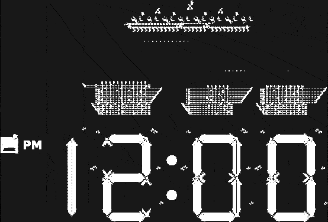
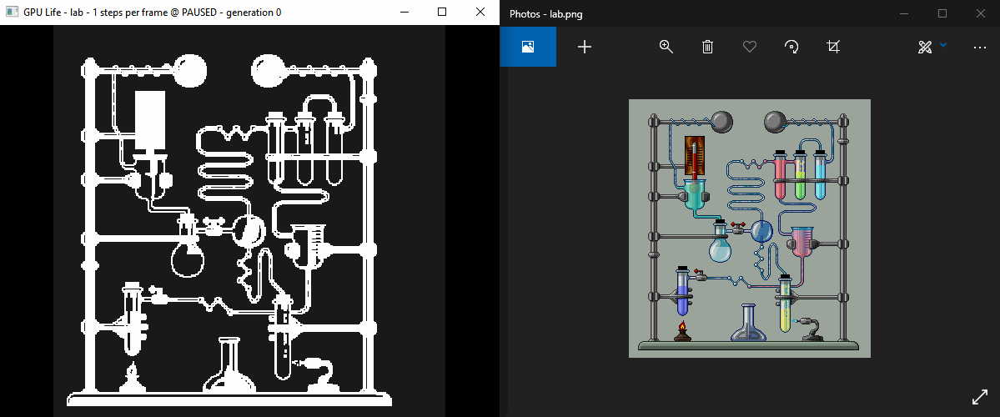
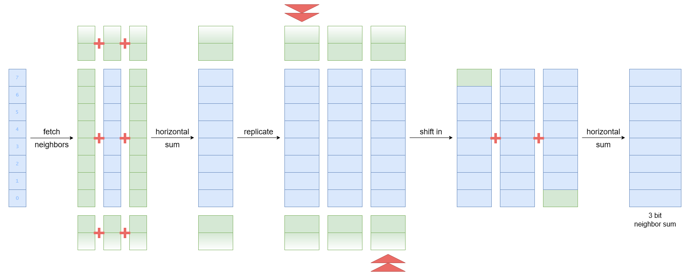

# GPU-Life

A GPU-accelarated Game of Life simulation capable of running very large patterns such as the [digital clock](https://youtu.be/3NDAZ5g4EuU) in real-time. In fact it was this digital clock pattern that inspired me to create this program. The [original author](https://codegolf.stackexchange.com/a/111932) of the clock pattern said:

> .. the only algorithm that makes this huge design useable is hashlife .. 

> .. with conventional algorithms, it is impractical to even see the hour changing ..

And that just rubbed me the wrong way, I had to prove otherwise. This program does **not** use the complicated [hashlife](https://conwaylife.com/wiki/HashLife) algorithm. It runs the conventional algorithm on the GPU using GLSL shaders, and it takes roughly 3 minutes to see 1 hour changing on the clock when running on a mobile GTX 1050. I would definitely call that _usable_.. pfff.

<p align="center">
  
</p>

## Features

- arbitrary world sizes, side-lengths must be a multiple of 32 and are rounded up
- arbitrary update rates
- wrap-around world
- sub-pixel rendering
- cross platform
- should work on 2005+ hardware
- patterns are rendered in real time
- modify patterns in real time
- light _and_ dark themes!
- load patterns from [.rle](https://www.conwaylife.com/wiki/Run_Length_Encoded), [.life](https://www.conwaylife.com/wiki/Life_1.06), or image files

<p align="center">
  
</p>

## Requirements

- OpenGL 3.0
- C99 compiler
- [GLFW](https://www.glfw.org/) window opening library

## Instructions

### Compile with GCC or clang

Install [GLFW](https://www.glfw.org/download.html) with your package manager, or try using the appropriate library file provided in the [`/lib`](./lib) directory.

```bash
$ gcc -std=c99 *.c -lm -lglfw
```

```bash
$ clang -std=c99 *.c -lm -lglfw
```

### Compile with MSVC

A [zip file](./Visual%20Studio%20Solution.zip) containing a complete visual studio solution is provided.

### Run

Simply run the compiled executable. If for whatever reason you don't want to compile from source, standalone pre-compiled executables are provided in the [`/bin`](./bin) directory. One is for [64-bit windows](./bin/GPU%20Life.exe) and the other is for [X11 linux](./bin/gpulife.out).

### Controls

 key                |    effect |
:-----------------: | :----------
`left-click`        | place cell
`right-click`       | remove cell
`drag-and-drop`     | load pattern from [file](https://www.conwaylife.com/wiki/Category:File_formats)
`space`             | single step
`enter`             | play/pause
`scroll`            | faster/slower
`ALT + drag`        | pan view
`ALT + scroll`      | zoom in/out
`C`                 | center view
`delete`            | clear all cells
`D`/`L`             | dark/light theme
`B`                 | toggle cell border
`F`                 | toggle fullscreen
`V`                 | toggle vsync
`ESC`               | quit program

The window title show the currently loaded pattern, as well as the current update rate, and FPS. Updates occur on a per-frame basis, so you can change the number of updates that happen each frame.

## Algorithm

This program uses the simplest, conventional Game of Life algorithm, in which cells are stored in a 2 dimensional array, and each cell in the field is individually updated based on its neighbors. The cell array is [double-buffered](https://gameprogrammingpatterns.com/double-buffer.html), meaning that while cells from generation _n_ are used to calculate cells for generation _n_ + 1, these two cell generations are stored in separate arrays. In case you don't know, the basic algorithm looks something like this:

```python
for x in [0, num-cells-x):
  for y in [0, num-cells-y):
    live-count = 0
    for dx in [x-1, x+1]:
      for dy in [y-1, y+1]:
        live-count += old-cells[dx][dy]
    old-cell = old-cells[x][y]
    new-cells[x][y] =
      1        | if live-count == 3,
      old-cell | if live-count == 4,
      0        | otherwise
```

The algorithm used here is variation of this basic algorithm running massively in parallel on the GPU. Instead of storing every cell in a separate array entry, entire columns of 32 cells are stored in each array entry, and so the array has dimensions `num-cells-x` × `num-cells-y/32`. This heavily reduces the memory usage: each cell is represented by only a single bit, leading to significantly improved cache utilization. This also allows us to update an entire column of 32 cells at once, instead of updating each cell individually.

<p align="center">
  
</p>

The diagram above illustrates how the neighbor count can be calculated for a column cells stored in an 8-bit machine word. Although we actually use 32-bit words in reality, the general idea is the same. First, the neighboring _columns_ are fetched. Then, every triplet of horizontal neighbors is added together to produce three 2 binary digit-numbers. Adding together three binary digits, `a`, `b`, and `c`, produces a two digit result `r1r0` like so:

```csharp
r0 = a ^ b ^ c
r1 = (a & b) | (b & c) | (c & a)
```

We've now calculated the number of _horizontal_ neighbors, but we've still to account for the _vertical_ neighbors. This is done in the next two steps. First, the two digit horizontal sum is replicated 3 times, and 2 of those replicas are bit shifted - one to the left by 1 bit, and the other to the right by 1 bit. Normally when bit shifting, zeros are shifted in, but we don't want this. What we want instead is to shift in the values from the neighboring horizontal sums. 

Now that we've interleaved the sums, we can calculate the final neighbor count for each cell by doing another horizontal sum. This time we are adding three 2-digit numbers `a1a0`, `b1b0`, and `c1c0`, and we are only interested in the 3 least significant bits of the result, `r2r1r0`. This can be calculated using bitwise operations like this:

```csharp
rc = (a0 & b0) | (b0 & c0) | (c0 & a0) // carry
r0 = a0 ^ b0 ^ c0
r1 = a1 ^ b1 ^ c1 ^ rc
r2 = ((a1 & (b1 | rc)) | (b1 & (c1 | rc)) (c1 & (a1 | rc))) & ~(a1 & b1 & c1 & rc)
```

And from here, we can easily calculate the next cell state.

## Optimization

The goal of this program is to be able to run the [digital clock pattern](https://codegolf.stackexchange.com/a/111932) in real time, so the first thing I did after implementing the most basic version of the simple algorithm is write a benchmark for this purpose. The pattern consists of a 10'016 × 6'796 cell world, and has a period of 11'520 generations per clock minute. So, this was the benchmark, how long does it take to simulate 11'520 generations of the clock count. In particular, rendering time was not taken into account here as the pattern was only rendered once at the end.

The final version of the program takes 3.2 seconds to simulate 11'520 generations.

## Licence

This software and its source code are in the public domain - you can do whatever you want with them, no strings attached :)

Credit goes to the stack-exchange user [dim](https://codegolf.stackexchange.com/users/64412/dim) for making the awesome digital-clock pattern, and to [Joe Z.](https://codegolf.stackexchange.com/users/7110/joe-z) for posting his challenge.
